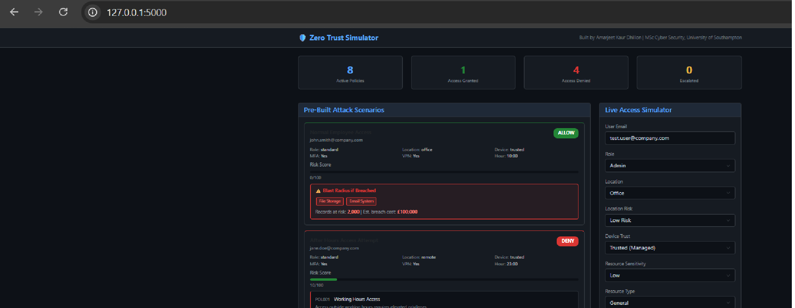
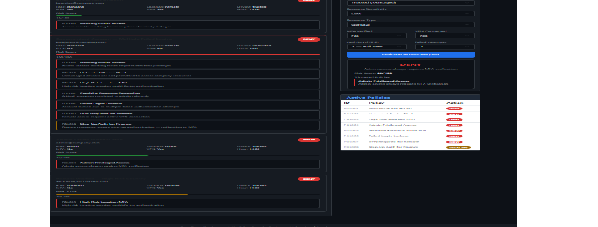

Zero Trust Simulator

A Zero Trust security policy engine that evaluates access requests against 8 configurable security policies, calculates risk scores, and simulates the blast radius of a potential breach if access is granted. Demonstrates the core principles of Zero Trust Architecture — never trust, always verify.

Built as part of MSc Cyber Security — University of Southampton.

What is Zero Trust?
Zero Trust is a security model based on the principle of never trust always verify. Unlike traditional perimeter security that trusts everything inside the network, Zero Trust continuously validates every access request regardless of location. Every user, device, and connection must be verified before accessing any resource.

Features
- 8 configurable Zero Trust security policies
- Real-time access request evaluation — ALLOW, DENY, or ESCALATE
- Risk scoring system 0-100 based on user, device, location, and behaviour
- Breach blast radius simulation — shows what systems would be compromised
- Estimated breach cost calculation per access decision
- 5 pre-built attack scenarios covering common threat patterns
- Live interactive access simulator with configurable parameters
- Active policies dashboard

Security Policies Implemented
- Working Hours Access Control
- Untrusted Device Block
- High Risk Location MFA Enforcement
- Admin Privileged Access MFA
- Sensitive Resource Protection
- Failed Login Account Lockout
- VPN Required for Remote Access
- Finance Step-Up Authentication

Tech Stack
- Python 3, Flask (web framework)
- Custom policy engine (rule-based)
- Bootstrap 5 (frontend)
- Chart.js (visualisation)

How to Run

1. Clone the repository
git clone https://github.com/AmarjeetkaurDhillon/zero-trust-simulator.git
cd zero-trust-simulator

2. Create virtual environment
python -m venv venv
venv\Scripts\activate

3. Install dependencies
pip install -r requirements.txt

4. Run the app
python app.py

5. Open in browser
Go to http://127.0.0.1:5000

Author
Amarjeet Kaur Dhillon
MSc Cyber Security — University of Southampton
GitHub: https://github.com/AmarjeetkaurDhillon